# 🍬 Sweet Shop Management System - TDD Kata

A Test-Driven Development implementation of a RESTful API for managing a sweet shop inventory with authentication and role-based access control.

**Incubyte Off-Campus Placement Drive Assessment**

[](https://github.com/lakhman108/incubyte-offcampus-tdd)
[](https://github.com/lakhman108/incubyte-offcampus-tdd)

---

## 📋 Overview

RESTful API built with **strict TDD methodology** (Red-Green-Refactor cycles) featuring:
- User authentication with JWT
- Sweet inventory CRUD operations
- Role-based access control (Customer/Admin)
- Search and filter capabilities
- Purchase and restock operations

**Tech Stack**: Node.js, Express.js, MongoDB, Jest, Supertest

---

## � Quickn Start

### Prerequisites
- Node.js (v14+)
- MongoDB (v4.4+)
- npm/yarn

### Installation
```bash
# Clone repository
git clone https://github.com/lakhman108/incubyte-offcampus-tdd.git
cd incubyte-offcampus-tdd

# Install dependencies
npm install
cd backend && npm install

# Configure environment (.env file in backend/)
PORT=5000
MONGODB_URI=mongodb://localhost:27017/sweetshop
JWT_SECRET=your_secret_key
JWT_EXPIRE=7d

# Start MongoDB
brew services start mongodb-community  # macOS

# Run application
npm run dev  # Development mode
npm start    # Production mode
npm test     # Run tests with coverage
```

---

## 🧪 Test Coverage

Comprehensive test suite with **11 test suites** covering:
- Model validation (User, Sweet)
- Authentication endpoints (register, login)
- Sweet CRUD operations
- Search and filter functionality
- Purchase and restock operations
- Role-based access control

---

## 📡 API Endpoints

| Method | Endpoint | Auth Required | Role | Description |
|--------|----------|---------------|------|-------------|
| POST | `/api/auth/register` | ❌ | Public | Register a new user |
| POST | `/api/auth/login` | ❌ | Public | Login and receive JWT token |
| POST | `/api/sweets` | ✅ | All | Create a new sweet |
| GET | `/api/sweets` | ✅ | All | Get all sweets |
| GET | `/api/sweets/search` | ✅ | All | Search sweets by name, category, or price |
| GET | `/api/sweets/:id` | ✅ | All | Get a specific sweet by ID |
| PUT | `/api/sweets/:id` | ✅ | All | Update sweet details |
| DELETE | `/api/sweets/:id` | ✅ | Admin | Delete a sweet |
| POST | `/api/sweets/:id/purchase` | ✅ | All | Purchase a sweet (decrease quantity) |
| POST | `/api/sweets/:id/restock` | ✅ | Admin | Restock a sweet (increase quantity) |

---

## 🎯 TDD Approach: Red-Green-Refactor

This project strictly follows the Test-Driven Development cycle:

```mermaid
graph TD
    A[🔴 RED<br/>Write a failing test] --> B[🟢 GREEN<br/>Write minimal code<br/>to make test pass]
    B --> C[🔵 REFACTOR<br/>Improve code while<br/>keeping tests green]
    C --> D{All tests pass?}
    D -->|Yes| E{Feature complete?}
    D -->|No| A
    E -->|No| F[Add next test case]
    E -->|Yes| G[✅ Feature Done]
    F --> A
    
    style A fill:#ffcccc,stroke:#ff0000,stroke-width:2px
    style B fill:#ccffcc,stroke:#00ff00,stroke-width:2px
    style C fill:#cce5ff,stroke:#0066cc,stroke-width:2px
    style G fill:#e6ffe6,stroke:#009900,stroke-width:3px
```



### TDD Cycle Example: User Registration

#### 🔴 Red Phase - Write Failing Test
```javascript
describe('POST /api/auth/register', () => {
  test('should register a new user successfully', async () => {
    const userData = {
      username: 'testuser',
      email: 'test@example.com',
      password: 'password123'
    };

    const res = await request(app)
      .post('/api/auth/register')
      .send(userData);
    
    expect(res.status).toBe(201);
    expect(res.body).toHaveProperty('message', 'User registered successfully');
    expect(res.body).toHaveProperty('user');
    expect(res.body.user).toHaveProperty('username', userData.username);
    expect(res.body.user).not.toHaveProperty('password');
  });
});
```
**Result**: Test fails ❌ (endpoint doesn't exist yet)

#### 🟢 Green Phase - Minimal Implementation
```javascript
// authController.js
const register = async (req, res) => {
  const { username, email, password } = req.body;
  
  const user = new User({ username, email, password });
  await user.save();
  
  return res.status(201).json({
    message: 'User registered successfully',
    user: {
      _id: user._id,
      username: user.username,
      email: user.email
    }
  });
};
```
**Result**: Test passes ✅

#### 🔵 Refactor Phase - Improve Code
```javascript
// Extract validation to utility
const { validateRegistration } = require('../utils/validators');

const register = async (req, res) => {
  try {
    const { username, email, password } = req.body;

    // Validate input
    const validationError = validateRegistration(username, email, password);
    if (validationError !== null) {
      return res.status(400).send({ error: validationError });
    }

    // Check if user already exists
    const existingUser = await User.findOne({ email });
    if (existingUser !== null) {
      return res.status(409).send({ error: 'already exists' });
    }

    // Save user (password hashing handled by User model pre-save hook)
    const user = new User({ username, email, password });
    await user.save();

    const userResponse = {
      _id: user._id,
      username: user.username,
      email: user.email,
      role: user.role,
      createdAt: user.createdAt
    };

    return res.status(201).json({
      message: 'User registered successfully',
      user: userResponse
    });
  } catch (error) {
    return res.status(500).json({
      error: 'Server error during registration'
    });
  }
};
```
**Result**: All tests still pass ✅, code is cleaner with proper validation, error handling, and security

---

## 🏗️ Project Structure

```
backend/src/
├── config/          # Database configuration
├── controllers/     # Route handlers (auth, sweets)
├── middleware/      # JWT authentication
├── models/          # Mongoose schemas (User, Sweet)
├── routes/          # API routes
├── tests/           # Test suites (11 files)
├── utils/           # Validators, token generator, query builder
└── server.js        # Entry point
```

---

## 🤖 My AI Usage

### Tools Used
- **Kiro AI IDE**: Code completion, test generation, refactoring suggestions
- **GitHub Copilot**: Boilerplate generation
- **ChatGPT**: Architecture decisions and debugging

### How I Used AI
- **Boilerplate** (30% AI): Initial controller/route structures → manually refined business logic
- **Tests** (40% AI): Suggested edge cases → manually wrote assertions following TDD
- **Documentation** (50% AI): Structured README → added project-specific details
- **Debugging** (20% AI): Error analysis → manually implemented and tested fixes
- **Refactoring** (25% AI): SOLID improvements → manually ensured test coverage

### Transparency
All AI-assisted commits include co-author attribution:
```bash
git commit -m "feat: implement user registration

Used Copilot for initial boilerplate.
Manually added validation and error handling.

Co-authored-by: GitHub Copilot <copilot@github.com>"
```

### My Approach
AI was a **productivity multiplier**, not a replacement. Every AI-generated code was:
1. Reviewed for correctness and security
2. Tested with TDD practices
3. Refactored to project standards
4. Fully understood before committing

---

## 📚 References

- **TDD Kata**: Incubyte's Sweet Shop Management System
- **TDD Methodology**: [Roy Osherove's TDD Kata](http://osherove.com/tdd-kata-1/), [Clean Code Blog](https://blog.cleancoder.com/uncle-bob/2014/12/17/TheCyclesOfTDD.html)
- **SOLID Principles**: [Uncle Bob's SOLID](https://blog.cleancoder.com/uncle-bob/2020/10/18/Solid-Relevance.html)

---

## 👨‍💻 Author

**Lakhman Parmar**

- GitHub: [@lakhman108](https://github.com/lakhman108)
- Repository: [incubyte-offcampus-tdd](https://github.com/lakhman108/incubyte-offcampus-tdd)

**Purpose**: Incubyte Off-Campus Placement Drive Assessment

---

### Special Thanks:
- **Incubyte**: For providing this assessment opportunity
- **TDD Community**: For promoting best practices in software development

---


## 📞 Contact & Support

For questions or feedback about this project:

- Open an issue on [GitHub Issues](https://github.com/lakhman108/incubyte-offcampus-tdd/issues)
- Email: luckyparmar737@gmail.com

---

<div align="center">

**Built with ❤️ using Test-Driven Development**


</div>
